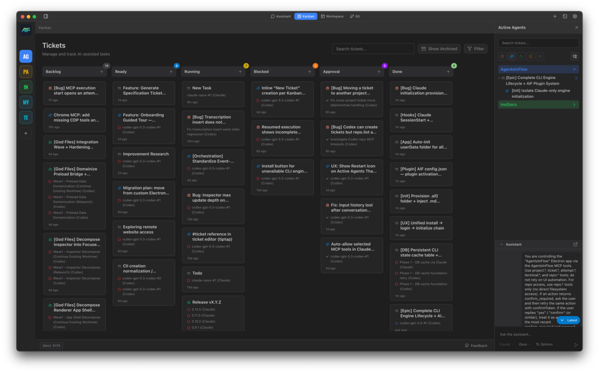

# AgentsInFlow

A desktop application to orchestrate multiple AI coding agents (Claude Code, Codex, Cursor) across your projects with a visual Kanban board.

## Features

- **Multi-agent orchestration** — Run Claude Code, Codex, and Cursor from a single interface
- **Kanban board** — Visual task management with drag-and-drop
- **Per-project configuration** — Engine settings, MCP servers, and model selection per repo
- **Git worktree branching** — Isolated experimentation without touching your main branch
- **Built-in PTY terminals** — Full terminal emulation with secret redaction
- **Token analytics** — Track input, output, cached, and reasoning tokens per execution
- **Session recovery** — Resume interrupted executions after app restart
- **Smart MCP session sharing** — Dynamic Chrome MCP port injection for multi-agent browser sessions
- **Free and fully unlocked** — All features currently available to all users

## Prerequisites

AgentsInFlow works with the following AI coding CLIs. Install at least one:

| Engine | Install | Login |
|--------|---------|-------|
| **Claude Code** (Anthropic) | `npm install -g @anthropic-ai/claude-code` | `claude login` |
| **Codex** (OpenAI) | `npm install -g @openai/codex` | `codex login` |
| **Cursor** | `cursor-agent` | `cursor-agent --login` |

AgentsInFlow auto-detects installed CLIs. Credentials persist across sessions.

## Installation

1. Download the latest release from [GitHub Releases](https://github.com/AgentsInFlow/AgentsInFlow/releases/latest)
2. **macOS**: Open the DMG and drag AgentsInFlow to Applications
3. Launch the application

### Supported Platforms

- macOS (Apple Silicon)
- Windows (planned)
- Linux (planned)

## Updates

- Automatic checks run in background (first check around 15 seconds after launch, then every 4 hours)
- Manual check is available in app menu:
  - macOS: `AgentsInFlow` → `Check for Updates...`
  - Windows/Linux: `Help` → `Check for Updates...`

## Quick Start

1. **Create a Project** — Click "New Project" and select a git repository folder
2. **Configure Engine** *(optional)* — Open project settings to set default engine, model, and MCP servers
3. **Create a Ticket** — Click "+" on the Kanban board, add title and description
4. **Run an Execution** — Click a ticket, select engine and model, optionally enable branching, then "Start"

## Configuration

Per-project engine settings are stored in your repository:

| Engine | Config Path |
|--------|-------------|
| Claude | `.claude/settings.local.json` |
| Codex | `.codex/config.toml` |
| Cursor | `.cursor/settings.json` |

## License

AgentsInFlow is proprietary software offered free during beta. See [Terms of Service](https://agentsinflow.github.io/terms.html) for details.

## Links

- [Website](https://agentsinflow.github.io)
- [Documentation](https://agentsinflow.github.io/docs/)
- [Changelog](https://agentsinflow.github.io/changelog.html)
- [Roadmap](https://agentsinflow.github.io/roadmap.html)
