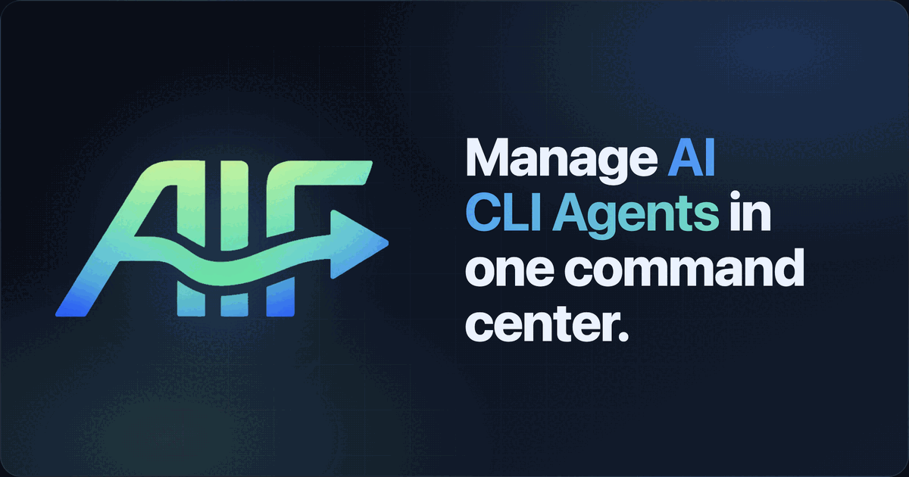
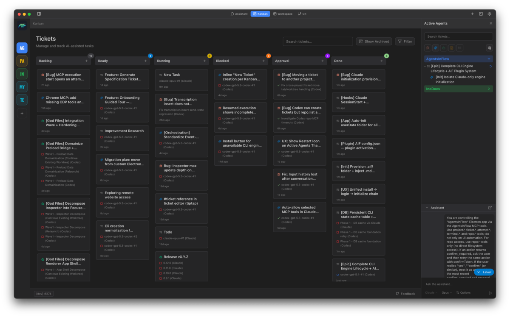
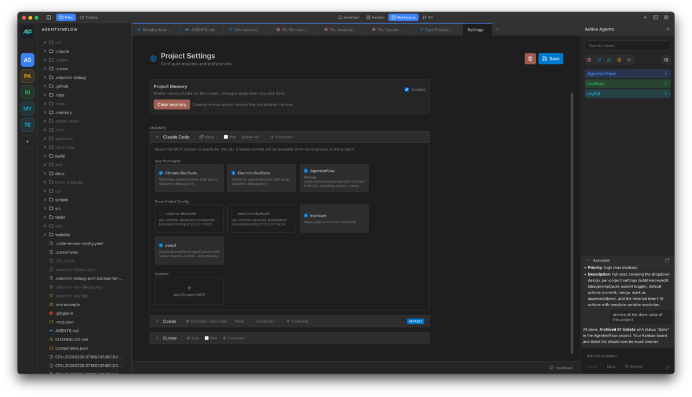
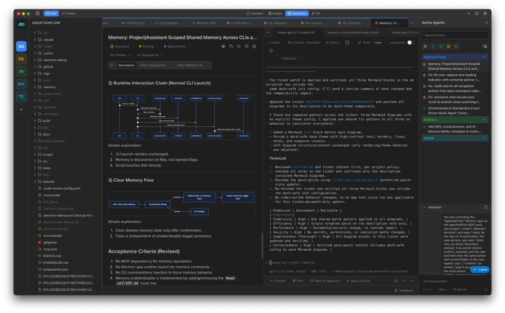
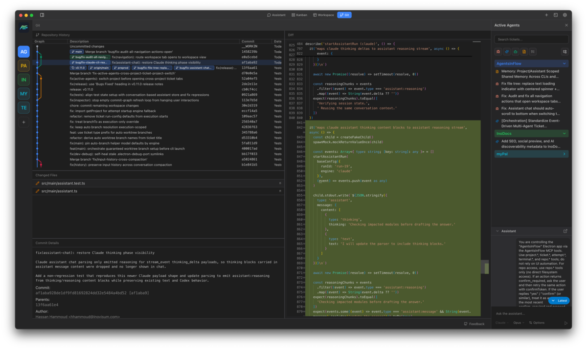
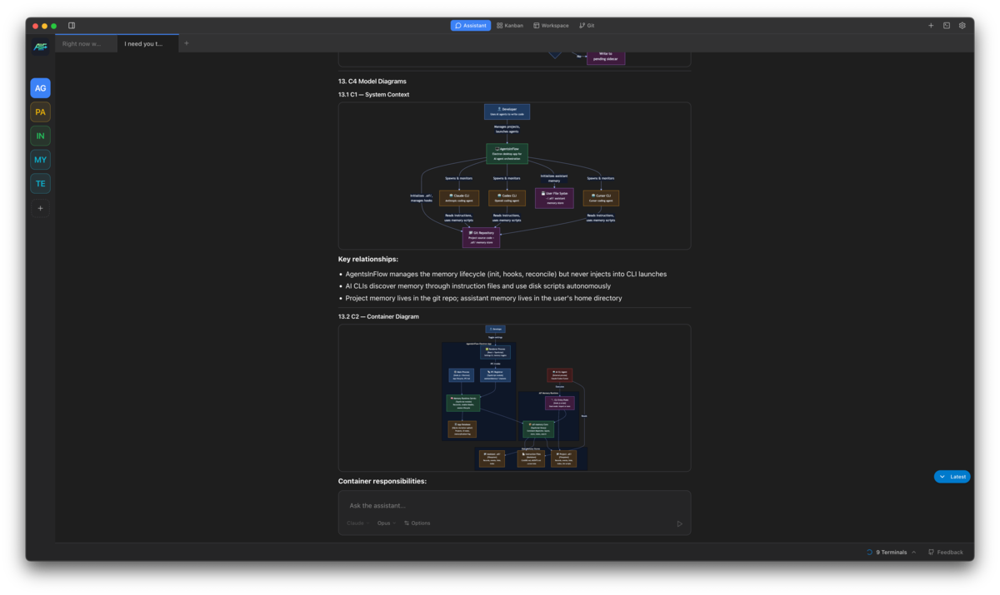
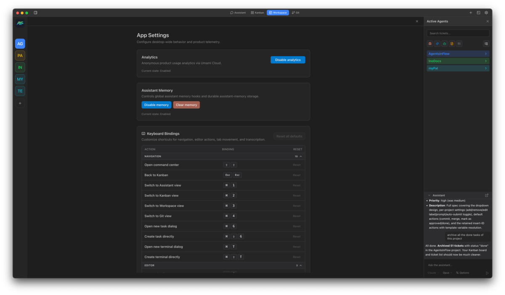
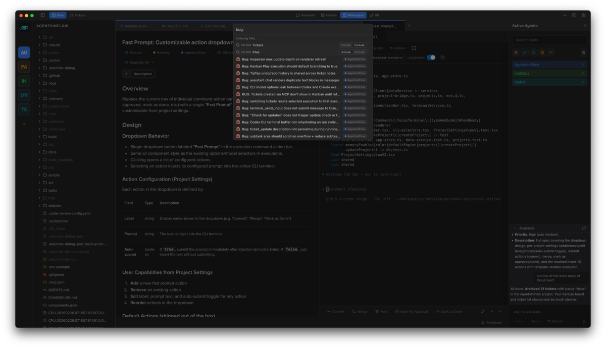
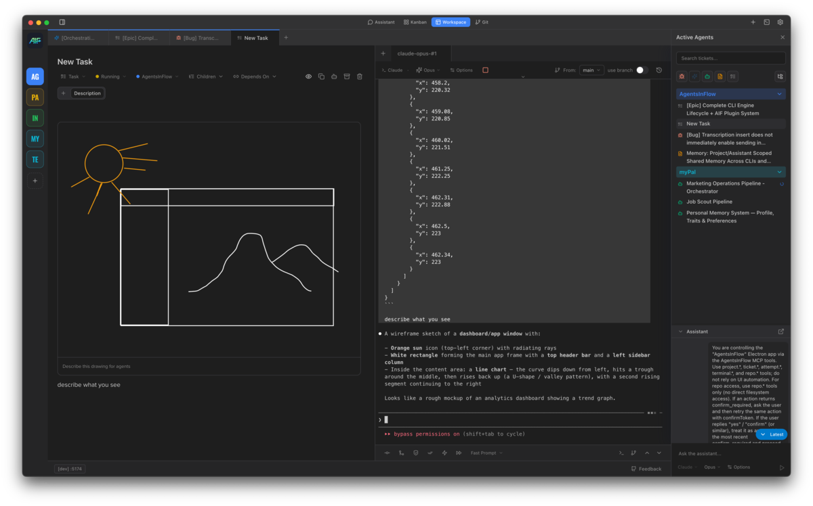
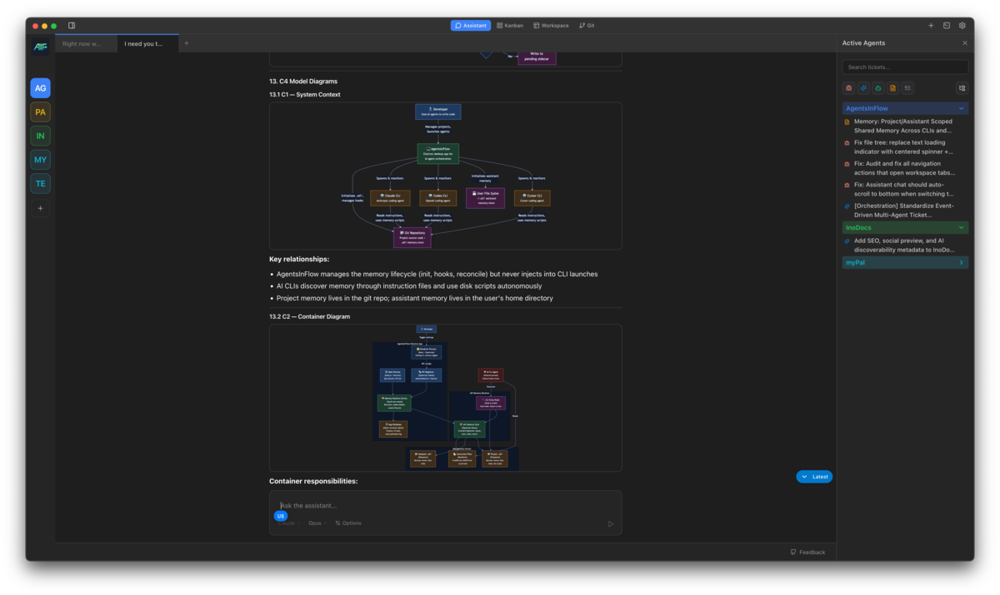

  

<h1 align="center">AgentsInFlow</h1>

  <strong>AI-Native Development Environment</strong> 
  Run Claude Code, Codex, and Cursor from one window. 
  Git version control, 28 diagram types, persistent AI memory, and isolated branching.

  
  
  

  <a href="https://github.com/hhammoud/AgentsInFlow/releases/latest">Download for macOS</a> ·
  <a href="https://github.com/hhammoud/AgentsInFlow/releases/latest">Download for Windows</a> ·
  <a href="https://aif.inovisum.com/changelog.html">Changelog</a> ·
  <a href="https://aif.inovisum.com/roadmap.html">Roadmap</a>

---

 

  

 

## One Window, Multiple Projects, Every Agent

AgentsInFlow is a desktop application that puts your AI coding agents, git workflow, task management, and documentation in a single workspace. No browser tabs, no context switching, no plugin chains. Each project gets its own Kanban board, engine configuration, and execution history.

 

## Features

### Multi-Engine Orchestration

Run **Claude Code**, **Codex**, and **Cursor** side by side. Pick the right engine and model per task, configure MCP servers per project, and monitor all running agents from a cross-project active agents panel. Token analytics track input, output, cached, and reasoning tokens for every execution.

  

### Kanban Task Management

Visual Kanban board with drag-and-drop across **Backlog, Ready, Running, Blocked, Approval, and Done** columns. Create tickets inline, search and filter across projects, archive completed work, and use the global **Command Center** (Cmd+K) to jump to any ticket or file instantly.

### Rich Markdown Editor with 28 Diagram Types

Full-featured editor with slash commands, inline formatting, and drag-and-drop content blocks. Embed **Mermaid, PlantUML, Graphviz, D2, C4, DBML, BPMN, ERD**, and 20 more diagram types rendered live inside ticket descriptions. Freehand sketching lets you draw wireframes and have AI agents analyze them.

  

### Git Version Control & Isolated Branching

Built-in **git graph visualization** with commit history, branch topology, and inline diffs. Every agent execution can run in an **isolated git worktree** — agents work on their own branch without touching your main code. Review changes, commit, or merge back when ready.

  

### Task Hierarchy & Dependencies

Organize work with **nested child tickets** that appear inside parent cards on the Kanban board. Link **blocking and dependent tickets** to enforce execution order. Navigate ticket ancestry with breadcrumb trails in the inspector.

  

### Persistent AI Memory

Project memory and assistant memory stored locally in `.aif/` — agents learn from past executions and apply context across sessions. Memory persists on disk, survives restarts, and is scoped per project so nothing leaks between workspaces.

  

### Voice Input & Fast Prompts

Record audio and transcribe with **OpenAI Whisper** — dictation routes directly to the active terminal. **Fast Prompts** let you define reusable prompt templates with variables, triggered from a dropdown in the execution bar.

  

### Built-in Terminals & Session Recovery

Full PTY terminal emulation with secret redaction, clickable file paths, find-in-terminal, and input history. Resume interrupted executions after app restart — sessions survive crashes and reconnect automatically.

### Freehand Sketching with AI Analysis

Draw wireframes, flowcharts, or UI mockups on an expandable canvas. Agents can see and interpret your sketches to generate code from visual ideas.

  

### AI Assistant with Inline Diagrams

Built-in assistant chat that renders diagrams inline. Ask the assistant to generate architecture diagrams, explain code flows, or plan implementations — all with live-rendered visual output.

  

### And More

- **File Explorer** — VS Code-style project tree with persistent tabs and auto-rename
- **Customizable Keyboard Shortcuts** — Rebind any action, chord sequences supported
- **Command Center** — Global Cmd+K palette to search tickets, files, and actions
- **Tab Management** — Drag-and-drop reordering, context menus, execution tab persistence
- **Smart MCP Session Sharing** — Dynamic Chrome MCP port injection for multi-agent browser sessions
- **Auto-Updating** — Background update checks with one-click install
- **Feedback Button** — Report issues directly from the app

---

## Prerequisites

AgentsInFlow works with the following AI coding CLIs. Install at least one:

| Engine | Install | Login |
|--------|---------|-------|
| **Claude Code** | `npm install -g @anthropic-ai/claude-code` | `claude login` |
| **Codex** | `npm install -g @openai/codex` | `codex login` |
| **Cursor** | `cursor-agent` | `cursor-agent --login` |

AgentsInFlow auto-detects installed CLIs and guides you through setup on first launch.

## Installation

Download the latest release from [GitHub Releases](https://github.com/hhammoud/AgentsInFlow/releases/latest):

| Platform | Format |
|----------|--------|
| **macOS** (Apple Silicon) | `.dmg` |
| **Windows** (x64) | `.exe` |

Open the installer, launch the app, and you're ready to go.

## Quick Start

1. **Create a Project** — Select a git repository folder
2. **Create a Ticket** — Add a title and describe the task in the rich editor
3. **Run an Execution** — Pick an engine and model, optionally enable branching, then start
4. **Review & Merge** — Check the git diff, commit from the inspector, or merge the worktree branch

## Links

- [Website](https://aif.inovisum.com)
- [Documentation](https://aif.inovisum.com/docs/)
- [Changelog](https://aif.inovisum.com/changelog.html)
- [Roadmap](https://aif.inovisum.com/roadmap.html)

## License

AgentsInFlow is proprietary software offered free during beta. See [Terms of Service](https://aif.inovisum.com/terms.html) for details.

---

Built by [Hassan H.](https://linkedin.com/in/hassanhammoud) · [@hghammoud](https://x.com/hghammoud) · [GitHub](https://github.com/hhammoud) · [Email](mailto:aif@inovisum.com)
